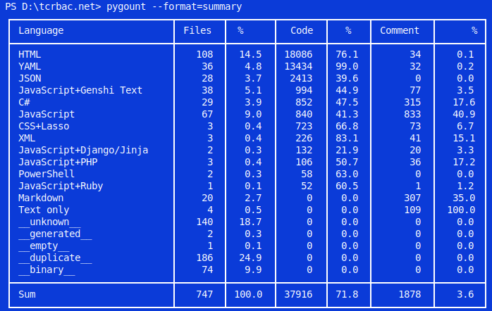

# TCRBAC.NET

TCRBAC.NET is a C# port inspired by Apache Tomcat's `tomcat-users.xml` user database, realm authentication, credential handling, and role-based access control flow.

## Start here

- [Project README](../README.md)
- [Documentation](docs/index.md)
- <a href="/docs/developer.html">Developer commands</a>
- <a href="/docs/Project-Structure.html">Project structure</a>
- [API](api/index.md)
- [Examples](examples/index.md)
- [Apache Tomcat Inspiration](https://tomcat.apache.org/tomcat-11.0-doc/realm-howto.html)

## Common commands

```powershell
dotnet restore
dotnet build
dotnet test
```

Generate the full documentation site:

```powershell
docfx metadata docfx.json
docfx build docfx.json
```

This updates API metadata under `docs\api` and the generated site under `build\site`. It does not start a server.


